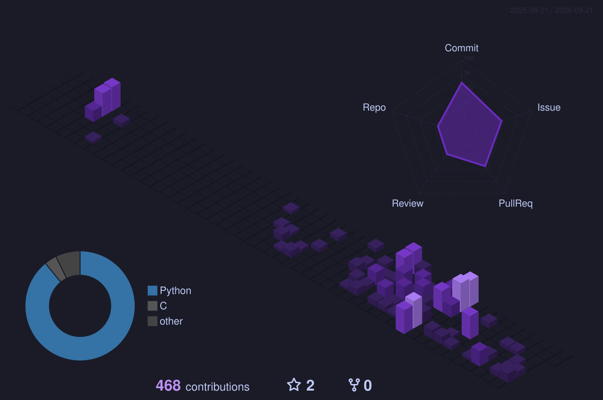

<h1 align="center">Hey, I'm Júlia 👋</h1>

<p align="center">
  
</p>

---

<h2 align="center">📊 Contribuições em 3D / 3D Contributions</h2>

<p align="center">
  
</p>

---

<table align="center" width="100%">
<tr>
<td width="50%" valign="top">

```text
⠀⠀⠀⠀⠀⠀⠀⠀⠀⠀⠀⠀⠀⠀⠀⠀⠀⠀⠀⠀⠀⠀⠀⠀⠀⠀⠀⠀⠀⠀⠀⠀⠀⠀
⠀⠀⠀⠀⠀⠀⠀⠀⠀⠀⠀⠀⠀⣀⣀⣀⢀⣤⣤⡀⠀⠀⠀⠀⠀⠀⠀⠀⠀⠀⠀⠀⠀⠀
⠀⠀⠀⠀⠀⠀⠀⠀⠀⢀⣤⣾⣿⡿⠛⠉⠉⠉⠉⠛⢦⣄⠀⠀⠀⠀⠀⠀⠀⠀⠀⠀⠀⠀
⠀⠀⠀⠀⠀⠀⠀⠀⢠⣾⣿⣿⠏⠀⠀⠀⠀⠀⠀⠀⠀⠙⣷⣄⠀⠀⠀⠀⠀⠀⠀⠀⠀⠀
⠀⠀⠀⠀⠀⠀⠀⣠⣿⣿⣿⡏⠀⠀⣀⣀⠀⠀⠀⠀⠠⠐⠸⣿⣆⠀⠀⠀⠀⠀⠀⠀⠀⣀
⠀⠀⠀⠀⠀⢀⣾⣿⣿⣿⣿⠁⠔⠉⠀⠀⠀⠀⠀⠀⢀⣀⣀⣼⣿⡄⠀⠀⠀⠀⠀⠀⠀⠉
⠀⠀⠀⠀⣠⣾⣿⣿⣿⣿⣿⠀⠀⠲⠶⠒⠂⠀⠀⠀⠀⠁⠀⠀⢻⣷⡀⠀⠀⠀⠀⠀⠀⢰
⠀⠀⠀⠈⣽⣿⣿⣿⣿⣿⣿⡄⠀⠀⠀⠀⠀⢀⣤⣤⠠⠂⠀⠀⢈⣿⡇⠀⠀⠀⠀⠀⠠⣼
⠀⠀⣤⣾⣿⣿⣿⣿⣿⡟⣿⣿⡄⠀⠀⠀⠀⠀⢀⣀⣀⣀⡀⠀⠸⣿⣧⠀⠀⠀⠀⠀⠀⠿
⡇⢸⣿⣿⣿⣿⣿⣿⣿⣷⣝⣿⣧⠀⠀⠀⠀⠈⠛⠉⠀⠀⠀⠀⠈⣧⣿⣆⠀⠀⠀⠀⠀⠀
⣇⣼⣿⣿⣿⣿⣿⣿⣿⣿⣿⣿⣿⣧⡀⠀⠀⠀⠀⠀⠀⠀⠀⠀⣰⣿⣿⣿⠀⣀⡀⠀⠀⠀
⣿⣿⣿⣿⣿⣿⣿⣿⣿⣿⣿⣿⣿⣿⣿⣷⣶⣴⣶⣤⣄⡀⠀⢼⣿⣿⣿⡟⠀⠉⠛⠀⠀⠐
⣿⣿⣿⣿⣿⣿⣿⣿⣿⣿⣿⣿⣿⣿⣿⣿⠿⠿⠿⠿⠋⠀⢀⠈⢿⣿⣿⣷⡄⠀⠠⠀⢨⣭
⣿⣿⣿⣿⣿⣿⣿⣿⣿⣿⣿⣿⣿⣿⡟⠁⠀⠀⠀⠀⠀⢰⠃⠀⠈⢻⣿⣿⡇⢀⠀⠀⠰⠭
⣿⣿⣿⣿⣿⣿⣿⣿⣿⣿⣿⣿⣿⣿⣷⣤⣤⣤⣀⣀⣀⣀⣁⣀⣀⣠⣬⣽⣿⣿⣿⣿⣿⣿
⣿⣿⣿⣿⣿⣿⣿⣿⣿⣿⣿⣿⣿⣿⣿⣿⣿⣿⣿⣿⣿⣷⣾⣿⣿⣿⣿⣿⣿⣿⣿⣿⣿⣿
⣿⣿⣿⣿⣿⣿⣿⣿⣿⣿⣿⣿⣿⣿⣿⣿⣿⣿⣿⣿⣿⣿⣿⣿⣿⣿⣿⣿⣿⣿⣿⣿⣿⣿
⣿⣿⣿⣿⣿⣿⣿⣿⣿⣿⣿⣿⣿⣿⣿⣿⣿⣿⣿⣿⣿⣿⣿⣿⣿⣿⣿⣿⣿⣿⣿⣿⣿⣿
```

</td>
<td width="50%" valign="top">

```text
julia@ai-lab-makers
--------------------
OS:            Linux
Editor:        VS Code + Claude Code
Linguagens:    Python 46% · C 45% · Shell 1%
Ferramentas:   N8N · Docker · Supabase · PostgreSQL · Claude Code
Repositórios:  12 públicos
Foco atual:    Automação de processos · Cibersegurança · Agentes de IA
```

</td>
</tr>
</table>

---

<p align="center">
🎓 Cursando <b>Engenharia de Software</b> na <b>UnB</b> (previsão de conclusão: julho/2028) · Integrante e tutora no <b>AI LAB MAKERS</b>, laboratório de soluções com IA para o mercado.
<br/><br/>
🔹 Foco em <b>Automação de Processos</b>, com estudos em <b>Cibersegurança</b> e aprofundamento em <b>agentes de IA</b>.
<br/><br/>
🔹 <strong>5º lugar</strong> na Robocore (VSSS, área de controle, 2025.2) · <strong>7 de 12 exercícios</strong> resolvidos no hackathon UNballons (2026.1).
</p>

<p align="center">
🎓 Studying <b>Software Engineering</b> at <b>UnB</b> (expected graduation: July/2028) · Member and mentor at <b>AI LAB MAKERS</b>, an AI-solutions-for-market lab.
<br/><br/>
🔹 Focused on <b>Process Automation</b>, studying <b>Cybersecurity</b> and diving deeper into <b>AI agents</b>.
<br/><br/>
🔹 <strong>5th place</strong> at Robocore (VSSS, control area, 2025.2) · <strong>7 of 12 exercises</strong> solved at the UNballons hackathon (2026.1).
</p>

---

<h2 align="center">🛠️ Tech Stack</h2>

<table align="center" width="100%">
<tr>
<td width="50%" valign="top">

#### 🔧 Automação de Processos

<div align="center">


<br/><br/>


</div>

#### 💻 Desenvolvimento (apoio)

<div align="center">


<br/><br/>


</div>

</td>
<td width="50%" valign="top">

#### 🔐 Outros interesses

<div align="center">


<br/><br/>

<sub>Estudos iniciais em Cibersegurança e aprofundamento em agentes de IA / harnesses.</sub>

</div>

</td>
</tr>
</table>

---

<h2 align="center">📋 GitHub Stats</h2>

<table align="center" width="100%">
<tr>
<td width="50%">

</td>
<td width="50%">

</td>
</tr>
<tr>
<td colspan="2" align="center">

</td>
</tr>
</table>

---

<h2 align="center">🎯 Currently focusing on</h2>

<table align="center" width="100%">
<tr>
<td width="60" align="center">🤖</td>
<td>Aprofundando conhecimento em <b>agentes de IA</b> e harnesses (Claude Code) no <b>AI LAB MAKERS</b>.</td>
</tr>
<tr>
<td width="60" align="center">🔐</td>
<td>Iniciando estudos em <b>Cibersegurança</b>.</td>
</tr>
<tr>
<td width="60" align="center">🎓</td>
<td>Concluindo <b>Engenharia de Software</b> na UnB (previsão: julho/2028).</td>
</tr>
</table>

---

<h2 align="center">🚀 Projetos em destaque</h2>

#### Automação de Processos

<table align="center" width="100%">
<tr>
<td>

**[Automatizar_Dossie](https://github.com/camposs04/Automatizar_Dossie)**
<br/>
<sub>Gerador automatizado de dossiês contábeis: app web em Python + Streamlit que padroniza a criação de documentos financeiros em DOCX a partir de dados, imagens e notas em Markdown, usando docxtpl, python-docx e pypandoc.</sub>

</td>
</tr>
<tr>
<td>

**[Finantial-reconciler](https://github.com/camposs04/Finantial-reconciler)**
<br/>
<sub>Sistema de conciliação financeira em Python + Streamlit que cruza planilhas de clientes e da empresa com um algoritmo de chaves compostas, classificando registros e exportando relatórios completos em Excel.</sub>

</td>
</tr>
<tr>
<td>

**[Automatizar_juncao_xlxs](https://github.com/camposs04/Automatizar_juncao_xlxs)**
<br/>
<sub>Ferramenta em Python + Streamlit para tratamento e consolidação de extratos bancários em Excel: corrige linhas quebradas, padroniza colunas e unifica arquivos em uma planilha mestra, identificando a instituição financeira automaticamente.</sub>

</td>
</tr>
</table>

#### Aplicações Web

<table align="center" width="100%">
<tr>
<td>

**[fifa_team_hub](https://github.com/FIFATeamHub/fifa_team_hub)**
<br/>
<sub>Portal seguro de gestão de documentos para comissões técnicas de seleções de futebol, com isolamento de dados entre equipes, controle de acesso por perfil e auditoria imutável. Frontend em Vue 3, backend em Flask (Python), implantado em produção no Google Cloud (PostgreSQL, Cloud Storage, Cloud Run). Projeto desenvolvido em equipe no AI LAB MAKERS — atuei como líder, PO e Scrum Master, rotacionando entre todas as áreas.</sub>

</td>
</tr>
</table>

---

<h2 align="center">📍 Where to find me</h2>

<p align="center">
<a href="https://www.linkedin.com/in/júlia-santana-campos-b6649a279"></a>
<a href="https://github.com/camposs04"></a>
<a href="mailto:julia.04.camposs@gmail.com"></a>
<a href="https://www.instagram.com/_.camposs_"></a>
</p>

<p align="center">

</p>

---

> "Corro atrás de cada objetivo com a mesma energia que coloco nos projetos que acredito que podem mudar alguma coisa de verdade."

